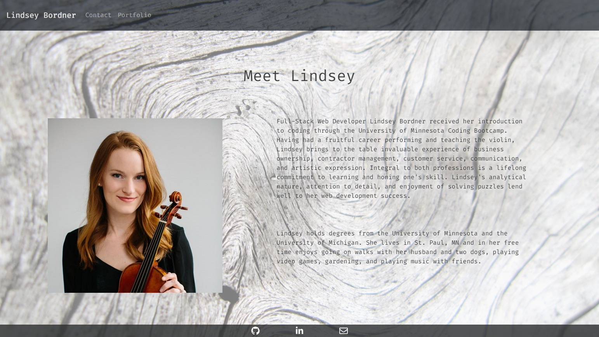

# Lindsey Bordner's Portfolio
  
  

  ## Table of Contents
  * [**Description**](#description)
  * [**Installation**](#installation)
  * [**Usage**](#usage)
  * [**Contributing**](#contributing)
  * [**Tests**](#tests)
  * [**Support Team**](#support-team)
  * [**License**](#license)
  * [**Questions**](#questions)

  ## Description
  This app is my personal portfolio, which I built with React. Please bear with me as I rework the Contact page into a Blog page.

  Deployed at: https://lindseybordner.herokuapp.com/  
  Repository: https://github.com/LindseyM20/LindseyM20

  ## Installation
  Commands to run to install dependencies: npm install

  ## Usage
  To use this program as a web application, simply visit the deploy link. To run locally, clone this repo, run 'npm i', and then run with 'npm start'.

  

  ## Contributing
  [Contributor Covenant Code of Conduct](https://www.contributor-covenant.org/version/2/0/code_of_conduct/code_of_conduct.md)

  ## Tests
  See REACT-README

  ## Support Team
  Special thanks to:  
  [Amanda Anderson](https://github.com/aanderson120)  
  [Brooklynne Audette](https://github.com/B-Audette)

  ## License
  The contents of this repository are protected under the MIT License

  ## Questions
  Follow me on GitHub at https://github.com/LindseyM20  
  Please contact me with any questions or feedback at lindsey.bordner@gmail.com 
